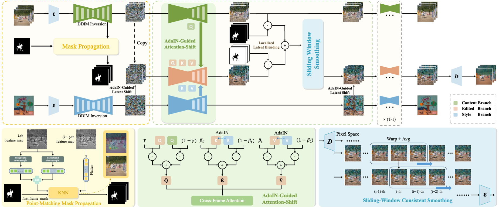

# UniVST: A Unified Framework for Training-free Localized Video Style Transfer
<p align="left">
  <a href='https://arxiv.org/abs/2410.20084'>
  </p>

## 0. Introduction

This is the official implementation of "UniVST: A Unified Framework for Training-free Localized Video Style Transfer". It operates without the need for training, offering a distinct advantage over existing methods that transfer style across entire videos. 

## 1. Environment Configuration
#### 1.1 Installation with the requirement.txt
```
git clone https://github.com/QuanjianSong/UniVST.git
conda create -n UniVST python=3.9
pip install -r requirements.txt
```
#### 1.2 Installation with environment.yaml
```
conda env create -f environment.yaml
```


## 2. Quick Start
#### 2.1 Inversion for original video.
```
python content_ddim_inv.py --content_path ./example/content/libby \
                            --output_dir ./output
```
Then, you will find the content inversion result in the ./output/content and ./output/content.
#### 2.2 Performance mask propagation.
```
python mask_propogation.py --feature_path ./output/features/libby/inversion_feature_301.pt \
                            --mask_path ./example/mask/libby.png \
                            --output_dir ./output
```
Then, you will find the mask propagation result in the ./output/mask.
#### 2.3 Inversion for style Image.
```
python run_style_ddim_inv.py --style_path ./example/style/style1.png \
                            --output_dir ./output
```
Then, you will find the style inversion result in the ./output/style.
#### 2.4 Style transfer.
```
python run_style_transfer.py --inv_path ./output/content/libby/inversion\
                            --mask_path ./output/mask/libby\
                            --style_path ./output/style/style1/inversion\ 
                            --output_dir ./output
```
Then, you will find the edit result in the ./output/edit.


## Citation
If you find this code helpful for your research, please cite:
```
@article{song2024univst,
  title={UniVST: A Unified Framework for Training-free Localized Video Style Transfer},
  author={Song, Quanjian and Lin, Mingbao and Zhan, Wengyi and Yan, Shuicheng and Cao, Liujuan},
  journal={arXiv preprint arXiv:2410.20084},
  year={2024}
}
```
